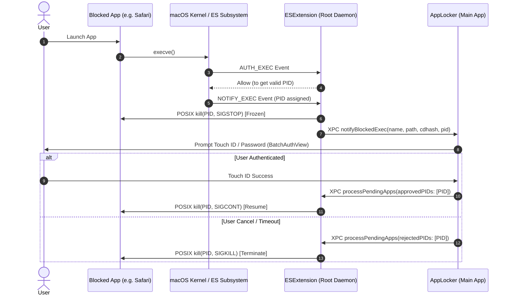

# Kiến Trúc Hiện Tại Của AppLocker (Existing Architecture)

## 1. Tổng Quan Hệ Thống (System Overview)
**AppLocker** là ứng dụng bảo mật chuyên biệt trên macOS (yêu cầu macOS 13+ Ventura trở lên), cung cấp cơ chế khóa và xác thực sinh trắc học (Touch ID) hoặc mật khẩu hệ thống trước khi cho phép các ứng dụng được chỉ định khởi chạy.

Dự án được chia thành 3 cấu phần cốt lõi:
1. **`AppLocker` (Main Application)**: Ứng dụng GUI người dùng (SwiftUI kết hợp AppKit), chạy ở không gian người dùng (User Space), quản lý danh sách ứng dụng, cấu hình, xử lý xác thực qua `LocalAuthentication`, giao diện Menu Bar và quản lý cửa sổ Batch Auth.
2. **`ESExtension` (Endpoint Security System Extension)**: System Extension chạy với quyền root (System Daemon), lắng nghe và chặn bắt các sự kiện tiến trình ở mức nhân (Kernel) thông qua Apple Endpoint Security Framework.
3. **`Shared` (Shared Core Framework/Files)**: Chứa các cấu trúc dữ liệu (`LockedAppConfig`), giao thức XPC (`ESAppProtocol`, `ESXPCProtocol`), helper bảo mật (`KeychainHelper` ECDSA P-256, `CDHashHelper`), tiện ích tìm kiếm (`FuzzySearch`) và hệ thống log tập trung (`Logfile`).

---

## 2. Chi Tiết Kiến Trúc Từng Thành Phần

### 2.1. Main Application (`AppLocker`)
- **Kiến trúc UI/State**:
  - Tầng hiển thị: SwiftUI Views kết hợp AppKit `NSWindowController` / `NSHostingController`.
  - State Management: Mô hình MVVM với `@MainActor` đảm bảo Thread-Safety cho `AppState`, `XPCServer`, `BatchAuthWindowController`.
  - Native macOS Design: Tận dụng Liquid Glass, `NavigationSplitView`, `Form`, `List`, hệ thống Material chuẩn của macOS, hỗ trợ đa ngôn ngữ (`en`, `vi`).
- **Giao tiếp XPC**:
  - `ESXPCClient`: Kết nối Mach Service tới `ESExtension`, khởi tạo bắt tay xác thực hai chiều (Mutual Authentication) trước khi gửi lệnh.
  - `XPCServer`: Lắng nghe thông báo tiến trình bị chặn (`notifyBlockedExec`) từ Extension, quản lý hàng đợi xác thực đơn lẻ hoặc theo lô (`BatchAuthView`).
- **Xác thực Người Dùng**:
  - Tích hợp `LocalAuthentication` (`LAContext`, `.deviceOwnerAuthentication`) hỗ trợ Touch ID và mật khẩu quản trị/người dùng.
- **Tối ưu & Quản lý Tài nguyên**:
  - `AppIconProvider`: Cache icon ứng dụng in-memory qua `NSCache`.
  - `AppState`: Quản lý tìm kiếm ứng dụng bằng Combine Debounce trên `RunLoop.main` và Spotlight query (`NSMetadataQuery`).
  - Dọn dẹp tài nguyên triệt để trong `deinit` (gỡ bỏ observer, hủy query, dọn dẹp HotKey).

### 2.2. Endpoint Security Extension (`ESExtension`)
- **Lớp Lắng Nghe & Chặn Bắt (Endpoint Security Clients)**:
  - `ESAuthorizer` (`AUTH_EXEC`, `NOTIFY_EXEC`, `NOTIFY_EXIT`):
    - `AUTH_EXEC`: Cho phép tạo tiến trình để kernel cấp phát PID hợp lệ (`ES_AUTH_RESULT_ALLOW`).
    - `NOTIFY_EXEC`: Lấy PID thật (> 0) và CDHash của tiến trình đích, kiểm tra danh sách khóa, lập tức phát tín hiệu POSIX `kill(targetPid, SIGSTOP)` để đóng băng tiến trình, sau đó gửi XPC notification tới `AppLocker`.
    - `NOTIFY_EXIT`: Dọn dẹp trạng thái và hàng đợi khi tiến trình kết thúc.
  - `ESTamper` (`AUTH_SIGNAL`, `AUTH_FILE`):
    - Chống can thiệp: Ngăn chặn gửi `SIGKILL`/`SIGSTOP` trái phép vào `AppLocker` hoặc `ESExtension`.
    - Bảo vệ file cấu hình và binary trên đĩa không bị chỉnh sửa khi chưa được cấp quyền.
- **Quy tắc An Toàn Tín Hiệu POSIX**:
  - Tuyệt đối không gọi `kill(0, signal)` để tránh làm gián đoạn nhóm tiến trình hoặc kết nối XPC. Luôn kiểm tra `guard pid > 0`.
- **Giao Tiếp Mach Service / XPC Listener (`ESMachListener`)**:
  - Khởi tạo Mach Service `com.TranPhuong319.AppLocker.xpc`.
  - Quản lý danh sách kết nối hoạt động với khóa đồng bộ `OSAllocatedUnfairLock`.

### 2.3. Lớp Bảo Mật & Xác Thực Hai Chiều (Security & Handshake)
- **Mutual ECDSA P-256 Authentication**:
  - Khi AppLocker kết nối XPC tới ESExtension, một chu trình bắt tay mã hóa diễn ra bằng `CryptoKit` (`P256.Signing`):
    1. Kiểm tra tính toàn vẹn nhị phân: Lấy `auditToken` của caller từ Kernel, trích xuất CDHash và so sánh với CDHash của file thực thi trên ổ đĩa.
    2. Client gửi Nonce + ECDSA Signature + Public Key.
    3. Extension xác minh chữ ký, tạo Server Nonce, ký mã hóa và gửi phản hồi.
    4. Chỉ các kết nối đã qua xác thực đầy đủ mới được phép ra lệnh mở khóa hoặc cấu hình danh sách chặn.

---

## 3. Luồng Hoạt Động Điển Hình (Typical Interception Flow)

---

## 4. Quy Chuẩn Lập Trình & Nguyên Tắc Đã Thiết Lập
1. **Swift Concurrency & Actor Isolation**: `@MainActor` cho toàn bộ UI và State; nền xử lý I/O, tính toán CDHash, xử lý ES event nằm trên background queues/tasks riêng.
2. **Apple Native First & YAGNI**: Ưu tiên chuẩn thư viện của Apple (CryptoKit, LocalAuthentication, AppIconProvider với NSCache, os.Logger / OSAllocatedUnfairLock), loại bỏ phụ thuộc bên thứ 3 không cần thiết.
3. **Tuân Thủ SwiftLint 100%**: 0 warning, 0 error, kiểm soát Cyclomatic Complexity $\le 10$, số dòng function $< 50$, line length $\le 120$.
4. **Bảo Toàn Tương Thích & Tính Bền Vững**: Không làm gãy giao thức XPC, duy trì tính bất biến của cơ chế xác thực CDHash và Endpoint Security.
