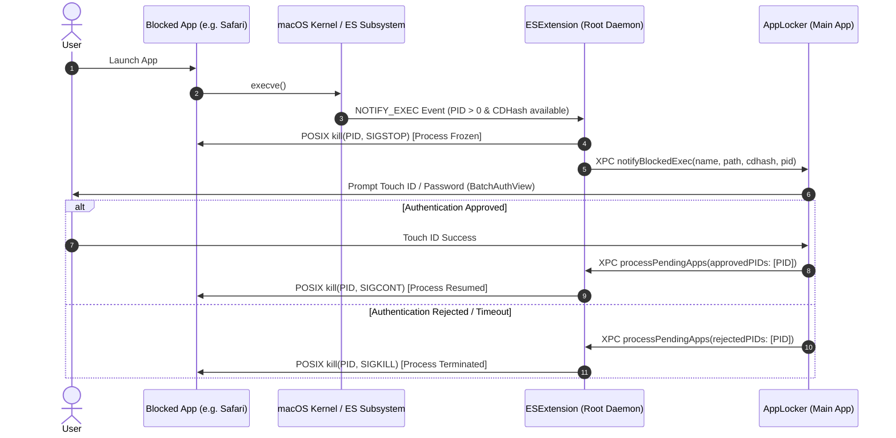

<div align="center">
  
  

  # AppLocker
  
  **Kernel-Level Privacy Protection & Application Locking for macOS**

  [](https://github.com/TranPhuong319/AppLocker/actions/workflows/main.yml)
  
  [](https://github.com/TranPhuong319/AppLocker/releases)
  
  
  
  
  
  
  

</div>

<p align="center">
  <b>Languages:</b>
  <a href="README.md">English</a> •
  <a href="Resources/README-vi.md">Tiếng Việt</a>
</p>

---

## 🎬 Live Demo

<div align="center">
  
  <p><i>Instant kernel interception with Touch ID authentication & batch unlocking</i></p>
</div>

---

## 📖 The Story Behind AppLocker

> *"I'm 15 years old. When lending my Mac to friends or classmates, I always worried about my personal data and private apps being accessed. macOS has no granular per-app locking mechanism out of the box. So I decided to build one myself."*

Starting with zero prior experience in low-level systems programming, I researched how Apple's **Endpoint Security Framework** and **POSIX signal handling** work under the hood (drawing inspiration from open-source references like Google Santa). With that architectural foundation, I partnered with **AI Coding Agents** to implement the Swift codebase, navigate tricky security hurdles, review logic, and debug issues. AppLocker is living proof that anyone with a clear vision can build real-world software to solve their own everyday problems.

---

## ✨ Key Features

- 🔒 **Zero Binary Modification**: Locks any target application without modifying its executable or breaking code signatures.
- ⚡ **Kernel-Level Interception**: Leverages Apple's **Endpoint Security Framework** (`AUTH_SIGNAL` & `NOTIFY_EXEC`) running as a root System Extension daemon.
- 🛡️ **POSIX Process Freezing**: Safely suspends target processes using `SIGSTOP` before any UI or window renders, resuming with `SIGCONT` upon successful authentication or terminating with `SIGKILL` on denial.
- 👆 **Biometric & System Authentication**: Seamless Touch ID, Apple Watch, or system password authentication powered by `LocalAuthentication`.
- 📦 **Intelligent Batch Authentication**: Automatically detects and groups multiple locked applications launched simultaneously, allowing you to approve or deny them in a single authentication step.
- 🛡️ **Built-in Anti-Tampering**: Intercepts unauthorized termination signals (`SIGKILL`/`SIGSTOP`) aimed at the security daemon or main app, and protects configuration files from tampering.
- 🎨 **Modern Liquid Glass UI**: Clean, native macOS interface built with SwiftUI and AppKit, supporting seamless Dark Mode and multi-language localization (`en`, `vi`).
- 🚀 **High Performance & Low Footprint**: In-memory `NSCache` icon caching (`AppIconProvider`), debounced Spotlight queries (`NSMetadataQuery`), and strictly isolated actor concurrency (`@MainActor`).

---

## 📸 Interface Showcase

| Main Dashboard | Single-App Authentication |
| :---: | :---: |
|  |  |
| **Manage & Configure Locked Applications** | **Touch ID / Password Interception Dialog** |

| Batch Authentication | Menu Bar Quick Access |
| :---: | :---: |
|  |  |
| **Simultaneous Multi-App Queue Processing** | **Instant Status & Quick Access Menu** |

---

## 🏛️ System Architecture

AppLocker is structured into three decoupled layers:

1. **`AppLocker` (Main Application)**: User-space GUI (SwiftUI + AppKit) managing app configurations, `LocalAuthentication`, Menu Bar status, and Batch Auth window dispatch on `@MainActor`.
2. **`ESExtension` (Endpoint Security Daemon)**: Privileged System Extension running as root. Handles `NOTIFY_EXEC`, `NOTIFY_EXIT`, and anti-tamper events (`AUTH_SIGNAL`, `AUTH_FILE`).
3. **`Shared Core`**: Shared XPC protocol contracts (`ESAppProtocol`, `ESXPCProtocol`), ECDSA P-256 cryptography helpers (`KeychainHelper`), CDHash verification (`CDHashHelper`), and unified logging (`os.Logger`).

### 🔄 Interception Flow



### 🔐 Security & Anti-Tampering

- **Signal Interception & Anti-Tamper (`AUTH_SIGNAL`)**: Monitors and denies unauthorized external POSIX signals (`SIGCONT`, `SIGKILL`, `SIGSTOP`) directed at suspended target apps, the daemon, or AppLocker, preventing unauthorized bypasses.
- **Mutual ECDSA P-256 Authentication**: XPC communication between `AppLocker` and `ESExtension` is protected by cryptographic challenge-response handshakes using `CryptoKit` (`P256.Signing`).
- **Binary Integrity Verification**: The caller's `audit_token` is verified against executable CDHashes to prevent process spoofing and unauthorized Mach service invocations.

---

## 💻 System Requirements

- **Operating System**: macOS 14.0 (Sonoma) or later.
- **Architecture**: Apple Silicon (M1/M2/M3/M4) and Intel (x86_64).

> [!NOTE]
> **Entitlements Notice**: Apple requires a paid **Apple Developer Program** account and explicit approval for the `com.apple.developer.endpoint-security.client` entitlement.
> 
> For local development and open-source testing without a paid provisioning profile, **System Integrity Protection (SIP)** must be disabled (`csrutil disable` in Recovery Mode for Intel, and Reduced Security mode for Apple Silicon) to allow the System Extension to register.

---

## 🚀 Installation & Usage

### Option 1: Download Pre-built Release
1. Download the latest `.dmg` from [Releases](https://github.com/TranPhuong319/AppLocker/releases).
2. Drag and drop **AppLocker.app** into `/Applications`.
3. Launch the app and follow the on-screen setup to approve the System Extension.
4. For detailed usage instructions, check the [User Guide](docs/USAGE.md).

### Option 2: Build from Source
```bash
# Clone the repository
git clone https://github.com/TranPhuong319/AppLocker.git
cd AppLocker

# Open in Xcode
open AppLocker.xcodeproj
```
1. Select the `AppLocker` scheme.
2. Build and run with **⌘ + R**.

---

## 👨‍💻 Author

**Trần Phương**  
- GitHub: [@TranPhuong319](https://github.com/TranPhuong319)  
- Facebook: [@TranPhuong2504](https://facebook.com/tranphuong2504)  

*Special thanks to Google's [Santa](https://github.com/google/santa) project for providing reference standards on Endpoint Security architecture.*

---

## 📄 License

This project is licensed under the **Apache License 2.0** — see the [LICENSE](LICENSE) file for details.
