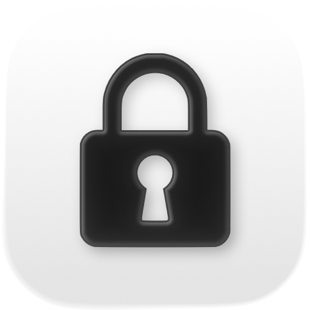
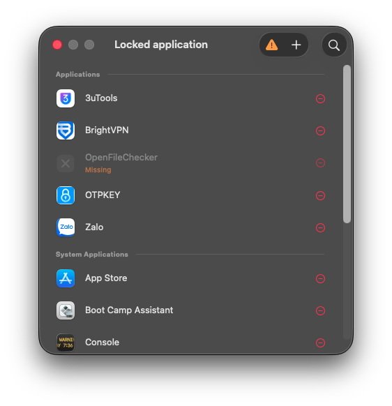
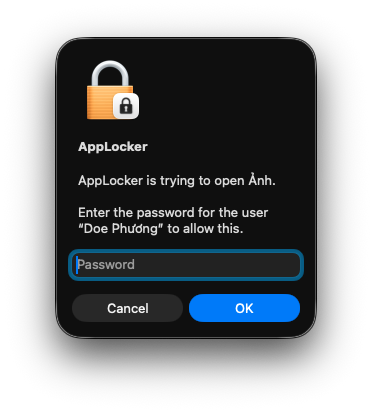
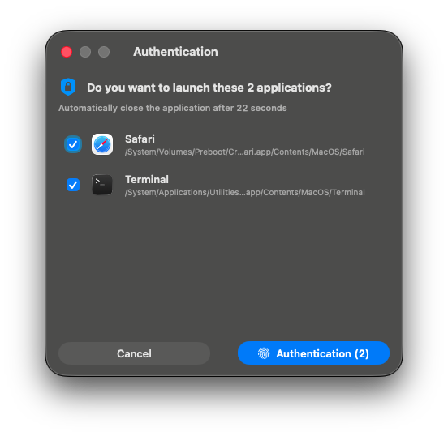
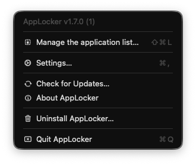
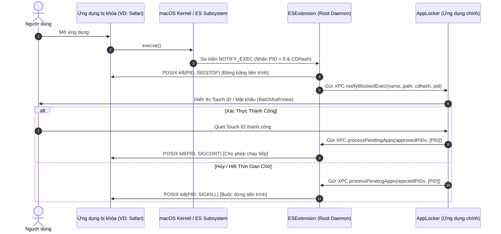

<div align="center">
  
  

  # AppLocker
  
  **Khóa Ứng Dụng & Bảo Vệ Quyền Riêng Tư Cấp Kernel Trên macOS**

  [](https://github.com/TranPhuong319/AppLocker/actions/workflows/main.yml)
  
  [](https://github.com/TranPhuong319/AppLocker/releases)
  
  
  
  
  
  
  

</div>

<p align="center">
  <b>Ngôn ngữ:</b>
  <a href="../README.md">English</a> •
  <a href="README-vi.md">Tiếng Việt</a>
</p>

---

## 🎬 Trải Nghiệm Trực Tiếp (Live Demo)

<div align="center">
  
  <p><i>Chặn bắt tức thì ở cấp độ Kernel, xác thực Touch ID mượt mà và mở khóa hàng loạt</i></p>
</div>

---

## 📖 Câu Chuyện Khởi Nguồn Của AppLocker

> *"Mình năm nay 15 tuổi. Mỗi khi cho bạn bè hay người khác mượn máy Mac, mình luôn lo lắng về việc dữ liệu cá nhân hay các ứng dụng riêng tư bị mở xem. macOS không có sẵn cơ chế khóa từng ứng dụng chi tiết. Vì vậy mình quyết định tự tay xây dựng một giải pháp."*

Bắt đầu từ con số 0 về lập trình hệ thống, mình đã tự tìm tòi, nghiên cứu cách hoạt động của **Apple Endpoint Security Framework** và cơ chế xử lý tín hiệu **POSIX** (học hỏi từ các dự án mã nguồn mở như Google Santa). Từ ý tưởng và kiến trúc đó, mình kết hợp cùng các **AI Coding Agents** để hiện thực hóa code Swift, giải quyết các bài toán bảo mật phức tạp, cùng review và liên tục sửa các lỗi phát sinh. AppLocker là minh chứng cho việc bất kỳ ai cũng có thể làm ra sản phẩm công nghệ thực thụ từ chính nhu cầu của mình.

---

## ✨ Tính Năng Nổi Bật

- 🔒 **Không Sửa Đổi File Nhị Phân (Zero Binary Modification)**: Khóa mọi ứng dụng mà không cần can thiệp vào file thực thi hay làm hỏng chữ ký số (Code Signature).
- ⚡ **Chặn ở Cấp Độ Kernel (Kernel-Level Interception)**: Khai thác sức mạnh của **Apple Endpoint Security Framework** (`AUTH_SIGNAL` & `NOTIFY_EXEC`) chạy dưới dạng System Extension quyền root.
- 🛡️ **Đóng Băng Tiến Trình An Toàn (POSIX Signal)**: Lập tức tạm dừng tiến trình bằng tín hiệu `SIGSTOP` trước khi cửa sổ ứng dụng kịp xuất hiện; tự động khôi phục bằng `SIGCONT` khi xác thực thành công hoặc hủy bằng `SIGKILL` khi từ chối.
- 👆 **Xác Thực Sinh Trắc Học Linh Hoạt**: Hỗ trợ Touch ID, Apple Watch hoặc mật khẩu hệ thống thông qua `LocalAuthentication`.
- 📦 **Xác Thực Hàng Loạt Thông Minh (Batch Auth)**: Tự động phát hiện và gộp nhiều ứng dụng bị khóa khởi chạy cùng lúc vào một cửa sổ duy nhất, giúp duyệt mở khóa nhanh chóng chỉ trong 1 lần xác thực.
- 🛡️ **Cơ Chế Chống Can Thiệp (Anti-Tampering)**: Ngăn chặn hành vi gửi tín hiệu tắt tiến trình (`SIGKILL`/`SIGSTOP`) vào Daemon bảo mật và ứng dụng chính, đồng thời khóa an toàn các file cấu hình.
- 🎨 **Giao Diện Liquid Glass Chuẩn Apple**: Thiết kế trực quan, hiện đại bằng SwiftUI và AppKit, hỗ trợ Dark Mode tự nhiên và đa ngôn ngữ (`en`, `vi`).
- 🚀 **Hiệu Năng Cao & Tối Ưu Bộ Nhớ**: Cache icon ứng dụng in-memory (`AppIconProvider`), tối ưu tìm kiếm Spotlight debounced (`NSMetadataQuery`), và cô lập luồng chặt chẽ với `@MainActor`.

---

## 📸 Hình Ảnh Giao Diện Thực Tế

| Bảng Điều Khiển Chính | Xác Thực Đơn Lẻ |
| :---: | :---: |
|  |  |
| **Quản lý danh sách ứng dụng cần khóa** | **Hộp thoại xác thực Touch ID / Mật khẩu** |

| Xác Thực Hàng Loạt (Batch Auth) | Menu Bar Tiện Lợi |
| :---: | :---: |
|  |  |
| **Gom nhóm và xử lý mở khóa nhiều app cùng lúc** | **Truy cập nhanh và xem trạng thái trên thanh Menu** |

---

## 🏛️ Kiến Trúc Hệ Thống

AppLocker được phân tách thành 3 tầng thành phần rõ ràng:

1. **`AppLocker` (Ứng Dụng Chính)**: Giao diện người dùng (SwiftUI + AppKit) quản lý cấu hình, `LocalAuthentication`, Menu Bar và điều phối cửa sổ Batch Auth trên `@MainActor`.
2. **`ESExtension` (Endpoint Security Daemon)**: System Extension chạy với quyền root (System Daemon). Xử lý các sự kiện `NOTIFY_EXEC`, `NOTIFY_EXIT`, và sự kiện chống can thiệp (`AUTH_SIGNAL`, `AUTH_FILE`).
3. **`Shared Core`**: Chia sẻ các giao thức XPC (`ESAppProtocol`, `ESXPCProtocol`), mật mã học ECDSA P-256 (`KeychainHelper`), trích xuất CDHash (`CDHashHelper`) và hệ thống ghi log tập trung (`os.Logger`).

### 🔄 Quy Trình Chặn Bắt & Mở Khóa



### 🔐 An Ninh & Chống Can Thiệp

- **Chặn Tín Hiệu & Chống Can Thiệp (`AUTH_SIGNAL`)**: Giám sát và từ chối các tín hiệu POSIX trái phép (`SIGCONT`, `SIGKILL`, `SIGSTOP`) từ bên ngoài nhắm vào các ứng dụng đang bị đóng băng, Daemon bảo mật hoặc AppLocker, ngăn chặn tuyệt đối việc vượt rào bảo vệ.
- **Xác Thực Hai Chiều ECDSA P-256 (Mutual Authentication)**: Giao tiếp XPC giữa `AppLocker` và `ESExtension` được bảo vệ bằng cơ chế bắt tay mã hóa sinh khóa ngẫu nhiên (Nonce) qua `CryptoKit` (`P256.Signing`).
- **Xác Minh Tính Toàn Vẹn CDHash**: Trích xuất `audit_token` của tiến trình gọi từ Kernel và đối chiếu với CDHash của file nhị phân trên đĩa nhằm ngăn chặn giả mạo kết nối XPC.

---

## 💻 Yêu Cầu Hệ Thống

- **Hệ Điều Hành**: Tối thiểu là macOS 14.0 (Sonoma) trở lên.
- **Kiến Trúc Phần Cứng**: Apple Silicon (M1/M2/M3/M4) và Intel (x86_64).

> [!NOTE]
> **Lưu Ý Về Entitlements**: Apple yêu cầu tài khoản **Apple Developer Program** trả phí ($99/năm) và xét duyệt thủ công cho quyền `com.apple.developer.endpoint-security.client`.
> 
> Để phát triển cục bộ và thử nghiệm mã nguồn mở mà không cần profile trả phí, cần tắt **System Integrity Protection (SIP)** (`csrutil disable` trong Recovery Mode đối với Intel và Hạ cấp bảo mật đối với Apple Silicon) để System Extension có thể đăng ký vào hệ thống.

---

## 🚀 Cài Đặt & Sử Dụng

### Cách 1: Tải Bản Cài Đặt Có Sẵn (Release)
1. Tải bản `.dmg` mới nhất từ mục [Releases](https://github.com/TranPhuong319/AppLocker/releases).
2. Kéo và thả file **AppLocker.app** vào thư mục `/Applications`.
3. Khởi chạy ứng dụng và làm theo hướng dẫn trên màn hình để cấp quyền System Extension.
4. Xem hướng dẫn chi tiết tại [Hướng dẫn sử dụng](../docs/USAGE-vi.md).

### Cách 2: Tự Build Từ Mã Nguồn (Xcode)
```bash
# Clone repository về máy
git clone https://github.com/TranPhuong319/AppLocker.git
cd AppLocker

# Mở dự án trong Xcode
open AppLocker.xcodeproj
```
1. Chọn scheme `AppLocker`.
2. Bấm **⌘ + R** để build và chạy.

---

## 👨‍💻 Tác Giả

**Trần Phương** 
- GitHub: [@TranPhuong319](https://github.com/TranPhuong319)  
- Facebook: [@TranPhuong2504](https://facebook.com/tranphuong2504)  

*Đặc biệt cảm ơn dự án mã nguồn mở [Santa](https://github.com/google/santa) của Google vì các tiêu chuẩn tham khảo mẫu mực về kiến trúc Endpoint Security.*

---

## 📄 Giấy Phép

Dự án này được phân phối dưới giấy phép **Apache License 2.0** — xem file [LICENSE](../LICENSE) để biết thêm chi tiết.
