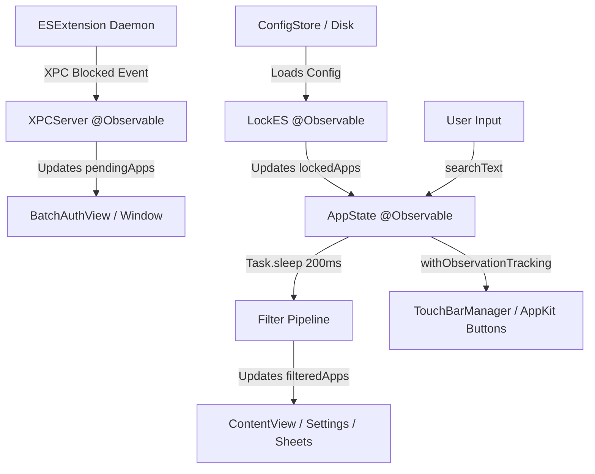

# Data Model: Modern State Stores & Observation Boundaries

**Feature**: `001-migrate-observable-state`
**Date**: 2026-08-22

## State Model Definitions

### 1. `AppState` (@Observable, @MainActor)
The primary application state container driving all primary UI flows.

- **Role**: Coordinates locked apps, search filters, modal sheet states, and system integration.
- **Key Properties**:
  - `manager: any LockManagerProtocol` (The active lock management backend)
  - `showingAddApp: Bool` (Add app modal visibility)
  - `showingDeleteQueue: Bool` (Delete queue sheet visibility)
  - `selectedToLock: Set<String>` (Apps currently selected in the picker sheet)
  - `deleteQueue: Set<String>` (Apps staged for removal/unlocking)
  - `isLocking: Bool` (Active locking operation spinner state)
  - `showingLockingPopup: Bool` (Batch locking feedback dialog)
  - `lockingMessage: String` (Status message during locking)
  - `searchTextLockApps: String` (Search query for locked apps list)
  - `searchTextUnlockaleApps: String` (Search query for installable apps list)
  - `filteredLockedApps: [InstalledApp]` (Debounced filtered locked apps)
  - `filteredUnlockableApps: [InstalledApp]` (Debounced filtered unlockable apps)
  - `lockedAppObjects: [InstalledApp]` (Resolved installed app representations of locked apps)
  - `unlockableApps: [InstalledApp]` (Apps available for locking discovered via Spotlight)
  - `activeTouchBar: TouchBarType` (Current TouchBar context)
- **Concurrency & Debouncing Tasks**:
  - `private var searchLockAppsTask: Task<Void, Never>?`
  - `private var searchUnlockableAppsTask: Task<Void, Never>?`

---

### 2. `LockES` (@Observable, @MainActor)
The concrete lock management service backed by Endpoint Security.

- **Role**: Mediates persistent configuration (`ConfigStore`) and daemon communication.
- **Key Properties**:
  - `lockedApps: [String: LockedAppConfig]` (Dictionary of locked application configs keyed by file path)
  - `allApps: [InstalledApp]` (All discovered installed applications)
  - `isProtectionDisabled: Bool` (Global temporary protection disable toggle)
- **Lifecycle & Callback Contract**:
  - `onConfigUpdated: (() -> Void)?` or direct method invocation to trigger `AppState.refreshAppLists()` when daemon sync or config bootstrap completes.

---

### 3. `XPCServer` (@Observable, @MainActor)
Coordinator for pending application interception alerts and batch authorization prompts.

- **Role**: Handles IPC authorization events from `ESExtension` and drives `BatchAuthWindowController`.
- **Key Properties**:
  - `authError: String?` (Active error message shown during biometric/passcode failure)
  - `pendingApps: [PendingAppItem]` (Queue of blocked applications awaiting user approval)
  - `remainingSeconds: Int` (Countdown timer for auto-lock / authorization timeout)

---

### 4. `ExtensionInstaller` (@Observable, @MainActor)
System Extension activation and approval state manager.

- **Role**: Manages OSSystemExtensionRequest lifecycle.
- **Key Properties**:
  - `isInstalled: Bool` (Indicates whether the system extension is currently approved and running)

---

## State Transition & Synchronization Map

